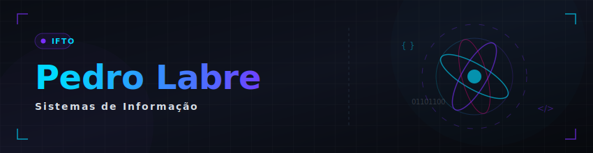
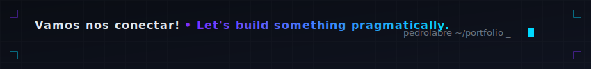

<div align="right">
  🇧🇷 <b>Português</b> &nbsp;•&nbsp; <a href="./README_EN.md">🇺🇸 English</a>
</div>

<div align="center">

</div>


<div align="center">

+-+IFTO;Desenvolvedor+de+Software+%7C+Web%2C+Mobile+%26+Desktop;Foco+em+resolu%C3%A7%C3%A3o+de+problemas%2C+Engenharia+de+Software+e+QA)

</div>

<div align="center">

[](https://linkedin.com/in/pedro-labre-2a987b386)
[](https://github.com/pedrolabre)
[](https://www.instagram.com/pedrolabre/)


</div>

---

## 💡 Sobre Mim & Abordagem de Desenvolvimento

Sou graduando em Sistemas de Informação no **IFTO** (5º Período). Atuo no desenvolvimento de soluções de software completas, abrangendo aplicações web, mobile e desktop, além de automações inteligentes e utilitários integrados. Minha visão técnica é pautada por:

1. **Simplicidade & Eficiência**: Priorizo a construção de soluções limpas, modulares e focadas em entregar valor real com alta performance, evitando complexidades desnecessárias.
2. **Uso Consciente de Ferramentas**: Enxergo as tecnologias modernas — incluindo documentações, ferramentas CLI e Inteligência Artificial — como excelentes aliadas de produtividade. Atuo revisando e validando cada trecho de código para garantir que a lógica atenda aos requisitos de forma estável e segura.

---

## Tecnologias Utilizadas em Projetos

<div align="center">

### ── Sistemas & Desktop ──


### ── Web & Mobile Development ──


### ── Bancos de Dados ──


### ── Ferramentas & Automação ──


### ── Qualidade de Código & Testes ──


</div>

---

## 📈 GitHub Stats

<div align="center">


</div>

<div align="center">


</div>

<div align="center">


</div>

## Projetos Acadêmicos (Sistemas de Informação - IFTO)

<details>
<summary><h3 style="display: inline-block; margin: 0.4em 0;">💻 Programação & Desenvolvimento de Sistemas</h3></summary>
<br/>

Estes são os projetos estruturados que desenvolvi para disciplinas da minha graduação em Sistemas de Informação no **IFTO**, onde apliquei formalmente paradigmas de desenvolvimento, conceitos de concorrência, sistemas operacionais e POO:

<div align="center">

| 📁 Projeto | 📝 Descrição | 🛠️ Stack | 🔗 |
|:---|:---|:---|:---:|
| **cpu-scheduling-simulator** | Simulador interativo de algoritmos de escalonamento de CPU (FIFO, SJF, SRTF, Prioridade, Round Robin) com gráficos de Gantt para Sistemas Operacionais | JavaScript • React | [](https://github.com/pedrolabre/cpu-scheduling-simulator) |
| **truth-or-dare-async-network** | Aplicativo mobile interativo de rede social e jogo assíncrono de verdade ou consequência, integrado com prototipagem de alta fidelidade e plano de testes | TypeScript • React Native • Expo | [](https://github.com/pedrolabre/truth-or-dare-async-network) |
| **LTP3-CRUD-Laravel** | Aplicação web com CRUD completo e persistência em banco de dados relacional, desenvolvida em Laravel para a disciplina de LTP3 | PHP • Laravel • Blade | [](https://github.com/pedrolabre/LTP3-CRUD-Laravel) |
| **Sistema-de-Cadastro-IFTO** | Cadastro acadêmico de pessoas aplicando conceitos fundamentais de orientação a objetos (POO) e arquitetura MVC | PHP | [](https://github.com/pedrolabre/Sistema-de-Cadastro-IFTO) |
| **Caixa-Eletronico** | Simulador lógico de caixa eletrônico com regras de negócio para saques e contagem de cédulas em PHP POO | PHP | [](https://github.com/pedrolabre/Caixa-Eletronico) |
| **gerenciador-de-livros-php** | CRUD web básico de controle de biblioteca pessoal para a disciplina de introdução ao desenvolvimento web | PHP | [](https://github.com/pedrolabre/gerenciador-de-livros-php) |
| **LTP2-site-receitas** | Portal frontend responsivo de receitas culinárias com simulação de rotas, login e painel de usuário em localStorage | HTML • CSS • JS | [](https://github.com/pedrolabre/pedrolabre/tree/main/academic/ltp2-desenvolvimento-web/LTP2-site-receitas) |
| **IHC-prototipo-ingles** | Protótipo interativo responsivo com pálpebras cartoon, piscadas, olhar estrábico e transição de formulários para a disciplina de Interface Homem-Máquina | HTML5 • CSS3 • JS | [](https://github.com/pedrolabre/pedrolabre/tree/main/academic/interface-homem-maquina/IHC-prototipo-ingles) |
| **atividade2-estrutura-dados** | Aplicação web interativa para manipulação e simulação visual de vetores e operações lógicas de Estrutura de Dados | JavaScript • HTML5 | [](https://github.com/pedrolabre/pedrolabre/blob/main/academic/estrutura-dados/atividade2-estrutura-dados.html) |
| **ltp2-calculadora-aritmetica** | Calculadora web interativa de operações aritméticas desenvolvida como atividade prática de LTP2 | JavaScript • HTML5 • CSS | [](https://github.com/pedrolabre/pedrolabre/blob/main/academic/ltp2-desenvolvimento-web/ltp2-calculadora-operacoes-aritmeticas.html) |
| **ltp2-tabuadas-interativas** | Páginas web interativas de tabuadas aritméticas dinâmicas desenvolvidas para a disciplina de LTP2 | JavaScript • HTML5 • CSS | [](https://github.com/pedrolabre/pedrolabre/blob/main/academic/ltp2-desenvolvimento-web/ltp2-tabuadas.html) |
| **ltp2-tabuadas-todas-operacoes** | Aplicação web interativa de tabuadas completas para todas as operações aritméticas básicas (adição, subtração, multiplicação e divisão) em LTP2 | JavaScript • HTML5 • CSS | [](https://github.com/pedrolabre/pedrolabre/blob/main/academic/ltp2-desenvolvimento-web/ltp2-tabuadas-todas-operacoes.html) |

</div>
</details>

<details>
<summary><h3 style="display: inline-block; margin: 0.4em 0;">📄 Especificações, Documentação & Engenharia de Testes</h3></summary>
<br/>

Relatórios técnicos, especificações de requisitos, planos de testes de QA e estudos de caso de engenharia de software desenvolvidos na graduação:

<div align="center">

| 📁 Documento | 📝 Descrição | 🛠️ Stack | 🔗 |
|:---|:---|:---|:---:|
| **ltp3-relatorio-gerenciador-livros** | Relatório técnico analítico finalizado de arquitetura e implementação da biblioteca digital CRUD em PHP | Documentação Técnica • PHP | [](https://github.com/pedrolabre/pedrolabre/blob/main/academic/ltp3-programacao-web/ltp3-relatorio-tecnico-gerenciador-livros.pdf) |
| **ltp2-projeto-site-receitas** | Especificação completa de requisitos e manual de arquitetura web para o portal responsivo de receitas | Requisitos • LTP2 | [](https://github.com/pedrolabre/pedrolabre/blob/main/academic/ltp2-desenvolvimento-web/ltp2-projeto-site-receitas.pdf) |
| **ltp3-consultoria-tecnologias-web** | Relatório técnico de consultoria e análise comparativa de stacks e arquiteturas de desenvolvimento web | Análise Técnica • LTP3 | [](https://github.com/pedrolabre/pedrolabre/blob/main/academic/ltp3-programacao-web/ltp3-consultoria-tecnologias-web.pdf) |
| **es2-plano-simples-testes** | Plano de testes estruturado e especificação de QA desenvolvido na disciplina de Engenharia de Software II | Engenharia de Testes • QA | [](https://github.com/pedrolabre/pedrolabre/blob/main/academic/engenharia-software-2/es2-plano-simples-testes.pdf) |
| **es2-trabalho-projeto-fenix** | Estudo de caso de gerenciamento ágil e análise de métricas no escopo do Projeto Fênix | Engenharia de Software II | [](https://github.com/pedrolabre/pedrolabre/blob/main/academic/engenharia-software-2/es2-trabalho-projeto-fenix.pdf) |
| **es2-atividade-metricas-software** | Pesquisa prática de avaliação e aplicação de métricas de acoplamento, coesão e complexidade ciclomática | Métricas • ESII | [](https://github.com/pedrolabre/pedrolabre/blob/main/academic/engenharia-software-2/es2-atividade-metricas-software.pdf) |
| **es2-atividade-metricas-qualidade** | Estudo analítico e mapeamento de métricas de qualidade de software baseado nos padrões da norma ISO/IEC 25010 | Qualidade • ESII | [](https://github.com/pedrolabre/pedrolabre/blob/main/academic/engenharia-software-2/es2-atividade-metricas-qualidade.pdf) |
| **especificacao-todan-1** | Documento contendo a definição do tema do aplicativo, criação do repositório no GitHub e lista de requisitos iniciais (Primeira Entrega) do T.O.D.A.N | Requisitos • LTP4 / Mobile | [](https://github.com/pedrolabre/pedrolabre/blob/main/academic/ltp4-aplicativo-android/Documento%20de%20Especificacao%20-%20T.O.D.A.N%20%28Truth%20or%20Dare%20Async%20Network%29%20-%20Primeira%20Entrega.pdf) |
| **especificacao-todan-2** | Documento contendo a especificação e definição detalhada de todos os requisitos do aplicativo (Segunda Entrega) do T.O.D.A.N | Requisitos • LTP4 / Mobile | [](https://github.com/pedrolabre/pedrolabre/blob/main/academic/ltp4-aplicativo-android/Documento%20de%20Especificacao%20-%20T.O.D.A.N%20%28Truth%20or%20Dare%20Async%20Network%29%20-%20Segunda%20Entrega.pdf) |
| **especificacao-todan-3** | Documento contendo a arquitetura lógica e o estado de desenvolvimento do MVP durante a primeira versão apresentada (Terceira Entrega) do T.O.D.A.N | Requisitos • LTP4 / Mobile | [](https://github.com/pedrolabre/pedrolabre/blob/main/academic/ltp4-aplicativo-android/Documento%20de%20Especificacao%20-%20T.O.D.A.N%20%28Truth%20or%20Dare%20Async%20Network%29%20-%20Terceira%20Entrega.pdf) |
| **especificacao-todan-4** | Documento contendo a revisão completa de escopo e a definição dos requisitos futuros planejados para a versão final (Quarta Entrega) do T.O.D.A.N | Requisitos • LTP4 / Mobile | [](https://github.com/pedrolabre/pedrolabre/blob/main/academic/ltp4-aplicativo-android/Documento%20de%20Especificacao%20-%20T.O.D.A.N%20%28Truth%20or%20Dare%20Async%20Network%29%20-%20Quarta%20Entrega.pdf) |
| **especificacao-todan-final** | Documento definitivo de encerramento contendo a documentação completa e consolidada da última versão do app (Entrega Final) do T.O.D.A.N | Requisitos • LTP4 / Mobile | [](https://github.com/pedrolabre/pedrolabre/blob/main/academic/ltp4-aplicativo-android/Documento%20de%20Especificacao%20-%20T.O.D.A.N%20%28Truth%20or%20Dare%20Async%20Network%29%20-%20Entrega%20Final.pdf) |
| **slides-todan-mvp-1** | Slide da primeira apresentação de concepção e escopo do MVP do aplicativo mobile T.O.D.A.N | Apresentação • Mobile | [](https://github.com/pedrolabre/pedrolabre/blob/main/academic/ltp4-aplicativo-android/Slide%20da%20primeira%20Apresentac%CC%A7a%CC%83o%20do%20MVP%20T.O.D.A.N%20%28Truth%20or%20Dare%20Async%20Network%29.pdf) |
| **slides-todan-mvp-final** | Slide da apresentação final com a demonstração e resultados do MVP do aplicativo mobile T.O.D.A.N | Apresentação • Mobile | [](https://github.com/pedrolabre/pedrolabre/blob/main/academic/ltp4-aplicativo-android/Slide%20da%20Apresentac%CC%A7a%CC%83o%20final%20do%20MVP%20T.O.D.A.N%20%28Truth%20or%20Dare%20Async%20Network%29.pdf) |
| **Consultoria-IFTOverso.pdf** | Estudo de caso e planejamento estratégico de infraestrutura para o ecossistema acadêmico IFTOverso | Engenharia de Software | [](https://github.com/pedrolabre/pedrolabre/blob/main/academic/engenharia-software-2/Consultoria-IFTOverso.pdf) |
| **es1-atividades-bimestre-2** | Compilação de trabalhos práticos e modelagens UML desenvolvidos no segundo bimestre de Engenharia de Software I | Modelagem UML • ESI | [](https://github.com/pedrolabre/pedrolabre/blob/main/academic/engenharia-software-1/es1-atividade-1-bimestre-2.pdf) |
| **projeto-gestao-infra-ti-escola** | Projeto de plano estratégico de governança, infraestrutura de rede e gestão de serviços de TI (ITIL/COBIT) para instituição de ensino | Plano de Governança • Gestão de TI | [](https://github.com/pedrolabre/pedrolabre/blob/main/academic/gestao-infraestrutura-ti/projeto-gestao-infra-ti-escola.pdf) |
| **lei-de-benford-analise** | Estudo teórico e histórico sobre a Lei de Benford, abordando seu processo de descoberta, conceitos matemáticos e aplicações práticas em auditoria | Estudo Teórico • Fundamentos de SI | [](https://github.com/pedrolabre/pedrolabre/blob/main/academic/fundamentos-sistemas-informacao/lei-de-benford-analise.pdf) |
| **cadastro_alunos-sql** | Script SQL estruturado de banco de dados relacional para controle acadêmico na disciplina de Banco de Dados II | SQL • DDL / DML | [](https://github.com/pedrolabre/pedrolabre/blob/main/academic/banco-dados-2/cadastro_alunos.sql) |
| **Plano-de-Negocio-Figma** | Plano de Negócios (PN) estruturando a viabilidade de mercado, escolhas tecnológicas e estratégias de marketing digital para um e-commerce de TI | Plano de Negócios • Comércio Eletrônico | [](https://github.com/pedrolabre/pedrolabre/blob/main/academic/comercio-eletronico/Plano%20de%20Neg%C3%B3cio%20com%20o%20Figma.pdf) |
| **Slide-Plano-de-Negocio-Figma** | Apresentação em slides do Plano de Negócios de e-commerce de TI desenvolvida para a disciplina de Comércio Eletrônico | Apresentação • Comércio Eletrônico | [](https://github.com/pedrolabre/pedrolabre/blob/main/academic/comercio-eletronico/Slide%20-%20Plano%20de%20Neg%C3%B3cio%20com%20a%20Figma.pdf) |
| **Protocolos-Comunicacao-Remota** | Apresentação em slides sobre Protocolos de Comunicação Remota (Telnet, SSH, SCP) abordando levantamento teórico e experimentos de teste com Wireshark | Apresentação • Redes de Computadores III | [](https://github.com/pedrolabre/pedrolabre/blob/main/academic/redes-computadores-3/Protocolos%20de%20Comunica%C3%A7%C3%A3o%20Remota.pptx.pdf) |

</div>
</details>

<details>
<summary><h3 style="display: inline-block; margin: 0.4em 0;">🧠 Teoria da Computação & Algoritmos Formais</h3></summary>
<br/>

Modelagem matemática e lógica teórica de autômatos desenvolvidas na disciplina de **Aspectos Teóricos da Computação**:

<div align="center">

| 📁 Projeto | 📝 Descrição | 🛠️ Stack | 🔗 |
|:---|:---|:---|:---:|
| **anbn.yaml** | Configuração formal e tabela de transições de estados para simulação de uma Máquina de Turing que valida a linguagem livre de contexto $a^n b^n$ | YAML • Teoria da Computação | [](https://github.com/pedrolabre/pedrolabre/blob/main/academic/aspectos-teoricos-computacao/anbn.yaml) |

</div>
</details>

<details>
<summary><h3 style="display: inline-block; margin: 0.4em 0;">🎨 Design de Interfaces & Usabilidade (IHC)</h3></summary>
<br/>

Telas interativas e protótipos de interfaces de usuário funcionais desenvolvidos para a disciplina de **Interface Homem-Máquina** aplicando princípios avançados de contraste, usabilidade e micro-animações:

<div align="center">

| 📁 Interface | 📝 Descrição | 🛠️ Stack | 🔗 |
|:---|:---|:---|:---:|
| **IHC-prototipo-ingles** | Protótipo interativo responsivo (inglês infantil) com animação de pálpebras cartoon, piscadas, olhar estrábico, winks antes de ações e formulário de login integrado | HTML5 • CSS3 • JS | [](https://github.com/pedrolabre/pedrolabre/tree/main/academic/interface-homem-maquina/IHC-prototipo-ingles) |
| **IHC-tela-cadastro-ingles.png** | Mockup de layout da tela de cadastro de inglês para crianças aplicando rigorosamente o contraste de cores 60-30-10 | IHC • UI/UX Design | [](https://github.com/pedrolabre/pedrolabre/blob/main/academic/interface-homem-maquina/IHC-tela-cadastro-ingles.png) |

</div>
</details>

---

## Laboratório de Utilitários Práticos (Projetos Pessoais & Automações)

<details>
<summary><h3 style="display: inline-block; margin: 0.4em 0;">🖥️ Desenvolvimento de Ferramentas, Extensões & Dashboards Local</h3></summary>
<br/>

Utilitários locais, extensões de navegador e ferramentas criadas por iniciativa própria para otimizar fluxos de trabalho do cotidiano. Projetos privados possuem indicador visual e acesso restrito de código:

<div align="center">

| 📁 Projeto | 📝 Descrição | 🛠️ Stack | 🔗 |
|:---|:---|:---|:---:|
| **price-simulator** | SPA para simulação de preços comerciais com cálculo de IPI, frete e margem, suporte multi-idioma e exportação | JavaScript • React | [](https://github.com/pedrolabre/price-simulator) |
| **photo_organizer** | Solução automatizada para organização cronológica de grandes acervos de fotos via metadados (EXIF) e detecção de duplicatas | Python • EXIF | [](https://github.com/pedrolabre/photo_organizer) |
| **personal-finance-manager** | Dashboard desktop local para controle de finanças pessoais utilizando padrão arquitetural MVVM | C# • WPF • SQLite | [](https://github.com/pedrolabre/personal-finance-manager) |
| **personal-consumption-tracker** | Aplicação desktop local para monitoramento, análise gráfica e rastreamento de consumo pessoal | C# • WPF • SQLite | [](https://github.com/pedrolabre/personal-consumption-tracker) |
| **Armário Virtual** 🔒 | Organizador pessoal offline de roupas com integração de widget meteorológico e métricas de Cost-per-Wear | Node.js • SQLite |  &nbsp; [](./docs/VC-Documentation-v1.html) |
| **youtube-organizer** 🔒 | Single Page Application (SPA) para curadoria, categorização e gerenciamento personalizado de vídeos do YouTube | JavaScript • React • Vite |  &nbsp; [](./docs/YO_Documentation_v2.html) |
| **tab-duplicate-detector** 🔒 | Extensão Chrome MV3 para detecção e limpeza inteligente de abas duplicadas via normalização regex | JavaScript • Chrome API |  &nbsp; [](./docs/TDD-Documentation-v1.html) |
| **tab-url-extractor** 🔒 | Extensão Chrome MV3 para extração, filtragem e exportação em lote de URLs de abas abertas em um clique | JavaScript • Chrome API |  &nbsp; [](./docs/TUE-Documentation-v1.html) |
| **tab-domain-executor** 🔒 | Extensão Chrome MV3 para gerenciamento, agrupamento e fechamento em lote de abas por domínios | TypeScript • Webpack • Chrome API |  &nbsp; [](./docs/TDE-Documentation-v1.html) |

</div>
</details>

---

## Scripts & Micro-Automações de Produtividade

<details>
<summary><h3 style="display: inline-block; margin: 0.4em 0;">⚡ Automação de Tarefas, Micro-Scripts & Utilitários Locais</h3></summary>
<br/>

Utilitários ágeis que desenvolvi para automatizar rotinas locais de infraestrutura, sincronização de projetos e tratamentos locais de arquivos em lote:

<div align="center">

| 📁 Script | 📝 Descrição | 🛠️ Stack | 🔗 |
|:---|:---|:---|:---:|
| **update_mobile_env_ip.py** | Sincroniza automaticamente a configuração de rede do app mobile com o IP local da máquina de desenvolvimento | Python | [](https://github.com/pedrolabre/pedrolabre/blob/main/scripts/automacao-desenvolvimento/update_mobile_env_ip.py) |
| **run-local.example.ps1** | Script modelo para configurar variáveis de ambiente e inicializar o servidor de banco de dados e backend localmente | PowerShell | [](https://github.com/pedrolabre/pedrolabre/blob/main/scripts/automacao-desenvolvimento/run-local.example.ps1) |
| **generate_reports.py** | Processa em lote imagens duplicadas locais, compilando estatísticas analíticas de economia de espaço | Python | [](https://github.com/pedrolabre/pedrolabre/blob/main/scripts/utilitarios-arquivos/generate_reports.py) |
| **export_hashes.py** | Calcula e exporta os hashes criptográficos de grandes bibliotecas de imagens para indexação ultra-veloz | Python | [](https://github.com/pedrolabre/pedrolabre/blob/main/scripts/utilitarios-arquivos/export_hashes.py) |
| **organizador_arquivos.py** | Organizador inteligente de arquivos locais que faz varredura e triagem para diretórios por extensão | Python | [](https://github.com/pedrolabre/pedrolabre/blob/main/scripts/utilitarios-arquivos/organizador_arquivos.py) |

</div>
</details>

---

## 📜 Certificados & Formação Complementar

Reúno certificações, cursos livres e participações em eventos acadêmicos/tecnológicos, totalizando **31 registros** organizados por área de competência.

<div align="center">

| 🤖 1. IA, Machine Learning & Prompt | 🐍 2. Programação, Python & Dados | 🛡️ 3. QA, Ops & Virtualização | 🏫 4. Extensão & Eventos |
|:---:|:---:|:---:|:---:|
| **13 Certificados** | **7 Certificados** | **3 Certificados** | **8 Certificados** |

<br/>

[](./certificados.md)

</div>

---

## 👨‍💻 Sobre mim (Ficha Técnico-Acadêmica)

```typescript
const dev = {
  nome:          "Pedro Roberto Ribeiro Bandeira Labre",
  perfil:        "Desenvolvedor de Software & Acadêmico",
  formacao:      "Graduando em Sistemas de Informação — IFTO",
  local:         "Brasil 🇧🇷",

  fundamentos:   ["Projetos Acadêmicos do IFTO", "FreeCodeCamp", "Codedex"],
  metodologia:   "Desenvolvimento de soluções simples, modulares e funcionais",
  habilidade:    "Construção de utilitários locais, dashboards desktop e extensões de navegador",
  focoAtual:     "Desenvolvimento mobile (React Native/Expo) e automação de tarefas",
} as const;
```

---

## 🐍 Contribuições

<div align="center">


</div>

---

<div align="center">

> *"O verdadeiro programador do futuro não é quem digita linhas de código decoradas, mas quem entende a lógica e direciona as melhores ferramentas com olhar crítico."*

<br/>

[](https://linkedin.com/in/pedro-labre-2a987b386) <!-- REPLACE WITH YOUR LINKEDIN LINK -->




</div>
