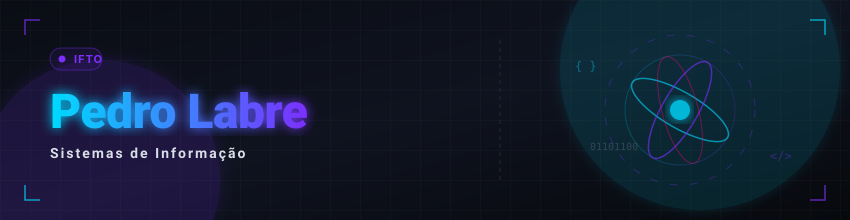
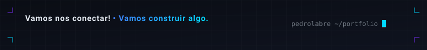

<div align="right">
  🇧🇷 <b>Português</b> &nbsp;•&nbsp; <a href="./README_EN.md">🇺🇸 English</a>
</div>

<div align="center">

</div>


<div align="center">

+-+IFTO;Desenvolvedor+de+Software+%7C+Web%2C+Mobile+%26+Desktop;Foco+em+resolu%C3%A7%C3%A3o+de+problemas%2C+Engenharia+de+Software+e+QA)

</div>

<div align="center">

[](https://www.linkedin.com/in/pedrolabre/)
[](https://github.com/pedrolabre)
[](https://www.instagram.com/pedrolabre/)


</div>

---

## 👤 Sobre Mim

Tenho 31 anos, experiência administrativa e inglês fluente — bagagem que acumulei antes de encontrar meu caminho no desenvolvimento de software. Cursei publicidade em Lisboa, mas a pandemia encerrou esse ciclo antes do tempo. De volta ao Brasil, me vi sem direção clara até encontrar o curso de Sistemas de Informação no IFTO. Fiz a seleção, passei em segundo lugar e finalmente senti que estava no lugar certo.

Com o tempo, percebi que tenho facilidade natural para identificar problemas e imaginar como resolvê-los — a maioria dos meus projetos nasce de uma frustração real. Agora estou no 6º período, construindo projetos focados no propósito e na utilidade prática, independentemente da stack, e aproveitando a graduação para explorar o máximo de áreas possível antes de decidir onde me aprofundar.

---

## 📋 Ficha Técnico-Acadêmica

```typescript
const dev = {
  nome:           "Pedro Roberto Ribeiro Bandeira Labre",
  papel:          "Desenvolvedor de Software",
  formacao:       "Sistemas de Informação — IFTO (6º Período)",
  local:          "Brasil 🇧🇷",

  historico:      "10+ anos de experiência profissional antes da transição para desenvolvimento",
  idiomas:        ["Português (nativo)", "Inglês (fluente)"],

  processo:       [
    "Dividir o escopo em fases antes de escrever qualquer código",
    "Documentar planos de implementação por bloco de funcionalidade",
    "Testar e validar cada fase de forma independente",
  ],

  focoAtual:      "Desenvolvimento web focado em Single Page Applications (SPA)",
  construindo:    "Soluções úteis baseadas em necessidades reais",
} as const;
```

---

## 🚀 Projetos Publicados

<table>
  <tr>
    <td align="center" valign="middle" width="80">
      
    </td>
    <td>
      <strong>Price Simulator</strong><br/>
      <small>Simulador de preços com cálculo de imposto, frete, margem e exportação de relatórios.</small><br/>
      <a href="https://price-simulator-psi.vercel.app" target="_blank">
        
      </a>
    </td>
  </tr>
  <tr>
    <td align="center" valign="middle" width="80">
      
    </td>
    <td>
      <strong>Logo QR Code Generator</strong><br/>
      <small>QR Codes com branding, SVG seguro, preview em tempo real e exportação em alta qualidade.</small><br/>
      <a href="https://logo-qr-code-generator-tool.vercel.app/" target="_blank">
        
      </a>
    </td>
  </tr>
  <tr>
    <td align="center" valign="middle" width="80">
      
    </td>
    <td>
      <strong>Subscription Lifecycle Supervisor</strong><br/>
      <small>Painel local-first para assinaturas, ciclos de cobrança e trials.</small><br/>
      <a href="https://subscription-lifecycle-supervisor.vercel.app/" target="_blank">
        
      </a>
    </td>
  </tr>
  <tr>
    <td align="center" valign="middle" width="80">
      
    </td>
    <td>
      <strong>O que o parlamentar fez</strong><br/>
      <small>Consulta pública para explorar parlamentares, proposições e votações com dados oficiais do Congresso Nacional.</small><br/>
      <a href="https://oqueoparlamentarfez.pages.dev/" target="_blank">
        
      </a>
    </td>
  </tr>
</table>

---

## Tecnologias Utilizadas em Projetos


<div align="center">

### ── ⌨️ Linguagens de Programação ──


### ── 💻 Desenvolvimento Web & Mobile ──


### ── 🎨 Frontend & Interface ──


### ── 🌐 Plataformas & Ecossistemas ──


### ── 🗄️ Dados & Persistência ──


### ── 🧪 Qualidade de Código & Testes ──


### ── 🔧 Ferramentas de Desenvolvimento ──


### ── 🧭 Design & Prototipação ──


</div>

---

## 📈 GitHub Stats

<div align="center">

<picture>
  <source media="(prefers-color-scheme: dark)" srcset="https://github-readme-stats-pied-mu.vercel.app/api?username=pedrolabre&show_icons=true&theme=tokyonight&hide_border=true&count_private=true&title_color=00D9FF&icon_color=7B2FFF&text_color=c9d1d9&bg_color=0d1117&locale=pt-br&v=5"/>
  <source media="(prefers-color-scheme: light)" srcset="https://github-readme-stats-pied-mu.vercel.app/api?username=pedrolabre&show_icons=true&theme=default&hide_border=true&count_private=true&title_color=00A3E0&icon_color=6C35DE&text_color=475569&bg_color=ffffff&locale=pt-br&v=5"/>
  
</picture>
<picture>
  <source media="(prefers-color-scheme: dark)" srcset="https://github-readme-stats-pied-mu.vercel.app/api/top-langs/?username=pedrolabre&layout=compact&theme=tokyonight&hide_border=true&title_color=00D9FF&text_color=c9d1d9&bg_color=0d1117&langs_count=8&count_private=true&locale=pt-br&v=5"/>
  <source media="(prefers-color-scheme: light)" srcset="https://github-readme-stats-pied-mu.vercel.app/api/top-langs/?username=pedrolabre&layout=compact&theme=default&hide_border=true&title_color=00A3E0&text_color=475569&bg_color=ffffff&langs_count=8&count_private=true&locale=pt-br&v=5"/>
  
</picture>

</div>

<div align="center">

<picture>
  <source media="(prefers-color-scheme: dark)" srcset="https://github-readme-streak-stats.herokuapp.com/?user=pedrolabre&theme=tokyonight&hide_border=true&ring=7B2FFF&fire=FF6B6B&currStreakLabel=00D9FF&sideLabels=00D9FF&background=0d1117&stroke=00D9FF&dates=8b949e&locale=pt-br&v=5"/>
  <source media="(prefers-color-scheme: light)" srcset="https://github-readme-streak-stats.herokuapp.com/?user=pedrolabre&theme=default&hide_border=true&ring=6C35DE&fire=FF5F56&currStreakLabel=00A3E0&sideLabels=00A3E0&background=ffffff&stroke=00A3E0&dates=475569&locale=pt-br&v=5"/>
  
</picture>

</div>

<div align="center">

<picture>
  <source media="(prefers-color-scheme: dark)" srcset="https://github-readme-activity-graph.vercel.app/graph?username=pedrolabre&theme=tokyo-night&hide_border=true&bg_color=0d1117&color=00D9FF&line=7B2FFF&point=ffffff&area=true&custom_title=Gr%C3%A1fico%20de%20Contribui%C3%A7%C3%B5es%20de%20Pedro%20Labre&locale=pt-br&v=5"/>
  <source media="(prefers-color-scheme: light)" srcset="https://github-readme-activity-graph.vercel.app/graph?username=pedrolabre&theme=default&hide_border=true&bg_color=ffffff&color=00A3E0&line=6C35DE&point=ffffff&area=true&custom_title=Gr%C3%A1fico%20de%20Contribui%C3%A7%C3%B5es%20de%20Pedro%20Labre&locale=pt-br&v=5"/>
  
</picture>

</div>

## 🎓 Projetos Acadêmicos (Sistemas de Informação - IFTO)

Estes são os projetos estruturados, trabalhos, relatórios e especificações de requisitos desenvolvidos para as disciplinas da minha graduação. Para manter a leitura do perfil dinâmica, a listagem completa foi movida para uma seção dedicada.

<div align="center">

[](./academic/README.md)

</div>

## 🖥️ Projetos Pessoais & Automações de Produtividade

Utilitários de uso pessoal, extensões de navegador, dashboards offline e micro-scripts desenvolvidos para automatizar tarefas cotidianas e otimizar fluxos de trabalho locais.

<div align="center">

[](./projetos.md)

</div>

---

## 📜 Certificados & Formação Complementar

Reúno certificações, cursos livres e participações em eventos acadêmicos/tecnológicos, totalizando **48 registros** organizados por área de competência.

<div align="center">

| 🤖 1. IA & ML | ⚙️ 2. Automação | 💻 3. Dev & Web | 📊 4. Dados & BI | 🛡️ 5. QA & Sec | 🎨 6. Design | 🏫 7. Eventos |
|:---:|:---:|:---:|:---:|:---:|:---:|:---:|
| **11 Certificados** | **3 Certificados** | **6 Certificados** | **13 Certificados** | **5 Certificados** | **1 Certificado** | **9 Certificados** |

<br/>

[](./certificados.md)

</div>

---

## 🐍 Contribuições

<div align="center">


</div>

---

<div align="center">

> *"O verdadeiro programador do futuro não é quem digita linhas de código decoradas, mas quem entende a lógica e direciona as melhores ferramentas com olhar crítico."*

<br/>

[](https://www.linkedin.com/in/pedrolabre/)




</div>
