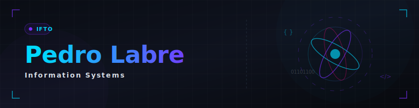
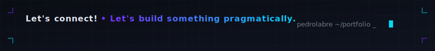

<div align="right">
  <a href="./README.md">🇧🇷 Português</a> &nbsp;•&nbsp; 🇺🇸 <b>English</b>
</div>

<div align="center">

</div>


<div align="center">

+-+IFTO;Software+Developer+%7C+Web%2C+Mobile+%26+Desktop;Focus+on+problem+solving%2C+Software+Engineering+and+QA)

</div>

<div align="center">

[](https://linkedin.com/in/pedro-labre-2a987b386)
[](https://github.com/pedrolabre)
[](https://www.instagram.com/pedrolabre/)


</div>

---

## 💡 About Me & Development Approach

I am an Information Systems undergraduate student at **IFTO** (5th Period). I work on the development of full-stack software solutions, spanning web, mobile, and desktop applications, as well as smart automations and integrated utilities. My technical vision is guided by:

1. **Simplicity & Efficiency**: I prioritize building clean, modular solutions focused on delivering real value with high performance, avoiding unnecessary complexities.
2. **Conscious Tooling**: I see modern technologies — including documentation, CLI tools, and Artificial Intelligence — as excellent productivity allies. I review and validate every snippet of code to ensure the logic meets the requirements in a stable and secure manner.

---

## Technologies Used in Projects

<div align="center">

### ── Systems & Desktop ──


### ── Web & Mobile Development ──


### ── Databases ──


### ── Tools & Automation ──


### ── Code Quality & Testing ──


</div>

---

## 📈 GitHub Stats

<div align="center">


</div>

<div align="center">


</div>

<div align="center">


</div>

---

## Academic Projects (Information Systems - IFTO)

<details>
<summary><h3 style="display: inline-block; margin: 0.4em 0;">💻 Programming & Systems Development</h3></summary>
<br/>

These are the structured projects I developed for courses in my Information Systems degree at **IFTO**, where I formally applied development paradigms, concurrency concepts, operating systems, and OOP:

<div align="center">

| 📁 Project | 📝 Description | 🛠️ Stack | 🔗 |
|:---|:---|:---|:---:|
| **cpu-scheduling-simulator** | Interactive CPU scheduling algorithm simulator (FIFO, SJF, SRTF, Priority, Round Robin) with Gantt charts for Operating Systems | JavaScript • React | [](https://github.com/pedrolabre/cpu-scheduling-simulator) |
| **truth-or-dare-async-network** | Interactive mobile social network app and asynchronous truth-or-dare game, integrated with high-fidelity prototyping and a test plan | TypeScript • React Native • Expo | [](https://github.com/pedrolabre/truth-or-dare-async-network) |
| **LTP3-CRUD-Laravel** | Web application with full CRUD and relational database persistence, developed in Laravel for the LTP3 course | PHP • Laravel • Blade | [](https://github.com/pedrolabre/LTP3-CRUD-Laravel) |
| **Sistema-de-Cadastro-IFTO** | Academic registration system applying fundamental object-oriented programming (OOP) concepts and MVC architecture | PHP | [](https://github.com/pedrolabre/Sistema-de-Cadastro-IFTO) |
| **Caixa-Eletronico** | Logical ATM simulator with business rules for withdrawals and bill counting using OOP PHP | PHP | [](https://github.com/pedrolabre/Caixa-Eletronico) |
| **gerenciador-de-livros-php** | Basic personal library control web CRUD for the introduction to web development course | PHP | [](https://github.com/pedrolabre/gerenciador-de-livros-php) |
| **LTP2-site-receitas** | Responsive recipe portal frontend with route simulation, login, and user dashboard in localStorage | HTML • CSS • JS | [](https://github.com/pedrolabre/pedrolabre/tree/main/academic/ltp2-desenvolvimento-web/LTP2-site-receitas) |
| **IHC-prototipo-ingles** | Responsive interactive prototype with cartoon eyelids, blinking, cross-eyed look, and form transitions for the Human-Computer Interaction course | HTML5 • CSS3 • JS | [](https://github.com/pedrolabre/pedrolabre/tree/main/academic/interface-homem-maquina/IHC-prototipo-ingles) |
| **atividade2-estrutura-dados** | Interactive web application for visual simulation and manipulation of arrays and logical Data Structure operations | JavaScript • HTML5 | [](https://github.com/pedrolabre/pedrolabre/blob/main/academic/estrutura-dados/atividade2-estrutura-dados.html) |
| **ltp2-calculadora-aritmetica** | Interactive web calculator for arithmetic operations developed as a practical activity for LTP2 | JavaScript • HTML5 • CSS | [](https://github.com/pedrolabre/pedrolabre/blob/main/academic/ltp2-desenvolvimento-web/ltp2-calculadora-operacoes-aritmeticas.html) |
| **ltp2-tabuadas-interativas** | Interactive web pages for dynamic arithmetic multiplication tables developed for the LTP2 course | JavaScript • HTML5 • CSS | [](https://github.com/pedrolabre/pedrolabre/blob/main/academic/ltp2-desenvolvimento-web/ltp2-tabuadas.html) |
| **ltp2-tabuadas-todas-operacoes** | Interactive web application of complete multiplication tables for all basic arithmetic operations (addition, subtraction, multiplication, and division) in LTP2 | JavaScript • HTML5 • CSS | [](https://github.com/pedrolabre/pedrolabre/blob/main/academic/ltp2-desenvolvimento-web/ltp2-tabuadas-todas-operacoes.html) |

</div>
</details>

<details>
<summary><h3 style="display: inline-block; margin: 0.4em 0;">📄 Specifications, Documentation & Testing Engineering</h3></summary>
<br/>

Technical reports, requirements specifications, QA test plans, and software engineering case studies developed during my undergraduate studies:

<div align="center">

| 📁 Document | 📝 Description | 🛠️ Stack | 🔗 |
|:---|:---|:---|:---:|
| **ltp3-relatorio-gerenciador-livros** | Finalized analytical technical report on the architecture and implementation of the CRUD digital library in PHP | Technical Documentation • PHP | [](https://github.com/pedrolabre/pedrolabre/blob/main/academic/ltp3-programacao-web/ltp3-relatorio-tecnico-gerenciador-livros.pdf) |
| **ltp2-projeto-site-receitas** | Complete requirements specification and web architecture manual for the responsive recipe portal | Requirements • LTP2 | [](https://github.com/pedrolabre/pedrolabre/blob/main/academic/ltp2-desenvolvimento-web/ltp2-projeto-site-receitas.pdf) |
| **ltp3-consultoria-tecnologias-web** | Technical consulting report and comparative analysis of web development stacks and architectures | Technical Analysis • LTP3 | [](https://github.com/pedrolabre/pedrolabre/blob/main/academic/ltp3-programacao-web/ltp3-consultoria-tecnologias-web.pdf) |
| **es2-plano-simples-testes** | Structured test plan and QA specification developed in the Software Engineering II course | Test Engineering • QA | [](https://github.com/pedrolabre/pedrolabre/blob/main/academic/engenharia-software-2/es2-plano-simples-testes.pdf) |
| **es2-trabalho-projeto-fenix** | Agile management case study and metrics analysis within the scope of the Phoenix Project | Software Engineering II | [](https://github.com/pedrolabre/pedrolabre/blob/main/academic/engenharia-software-2/es2-trabalho-projeto-fenix.pdf) |
| **es2-atividade-metricas-software** | Practical research on evaluating and applying coupling, cohesion, and cyclomatic complexity metrics | Metrics • ESII | [](https://github.com/pedrolabre/pedrolabre/blob/main/academic/engenharia-software-2/es2-atividade-metricas-software.pdf) |
| **es2-atividade-metricas-qualidade** | Analytical study and mapping of software quality metrics based on ISO/IEC 25010 standards | Quality • ESII | [](https://github.com/pedrolabre/pedrolabre/blob/main/academic/engenharia-software-2/es2-atividade-metricas-qualidade.pdf) |
| **especificacao-todan-1** | Document containing the application theme definition, GitHub repository creation, and initial requirements list (First Delivery) for T.O.D.A.N | Requirements • LTP4 / Mobile | [](https://github.com/pedrolabre/pedrolabre/blob/main/academic/ltp4-aplicativo-android/Documento%20de%20Especificacao%20-%20T.O.D.A.N%20%28Truth%20or%20Dare%20Async%20Network%29%20-%20Primeira%20Entrega.pdf) |
| **especificacao-todan-2** | Document containing the detailed specification and definition of all application requirements (Second Delivery) for T.O.D.A.N | Requirements • LTP4 / Mobile | [](https://github.com/pedrolabre/pedrolabre/blob/main/academic/ltp4-aplicativo-android/Documento%20de%20Especificacao%20-%20T.O.D.A.N%20%28Truth%20or%20Dare%20Async%20Network%29%20-%20Segunda%20Entrega.pdf) |
| **especificacao-todan-3** | Document containing the logical architecture and development state of the MVP during the first presented version (Third Delivery) for T.O.D.A.N | Requirements • LTP4 / Mobile | [](https://github.com/pedrolabre/pedrolabre/blob/main/academic/ltp4-aplicativo-android/Documento%20de%20Especificacao%20-%20T.O.D.A.N%20%28Truth%20or%20Dare%20Async%20Network%29%20-%20Terceira%20Entrega.pdf) |
| **especificacao-todan-4** | Document containing the complete scope review and definition of future requirements planned for the final version (Fourth Delivery) for T.O.D.A.N | Requirements • LTP4 / Mobile | [](https://github.com/pedrolabre/pedrolabre/blob/main/academic/ltp4-aplicativo-android/Documento%20de%20Especificacao%20-%20T.O.D.A.N%20%28Truth%20or%20Dare%20Async%20Network%29%20-%20Quarta%20Entrega.pdf) |
| **especificacao-todan-final** | Definitive project closure document containing the complete and consolidated documentation of the last app version (Final Delivery) for T.O.D.A.N | Requirements • LTP4 / Mobile | [](https://github.com/pedrolabre/pedrolabre/blob/main/academic/ltp4-aplicativo-android/Documento%20de%20Especificacao%20-%20T.O.D.A.N%20%28Truth%20or%20Dare%20Async%20Network%29%20-%20Entrega%20Final.pdf) |
| **slides-todan-mvp-1** | Slide presentation of the first MVP pitch and conception for the T.O.D.A.N mobile app | Presentation • Mobile | [](https://github.com/pedrolabre/pedrolabre/blob/main/academic/ltp4-aplicativo-android/Slide%20da%20primeira%20Apresentac%CC%A7a%CC%83o%20do%20MVP%20T.O.D.A.N%20%28Truth%20or%20Dare%20Async%20Network%29.pdf) |
| **slides-todan-mvp-final** | Slide presentation of the final MVP demo and results for the T.O.D.A.N mobile app | Presentation • Mobile | [](https://github.com/pedrolabre/pedrolabre/blob/main/academic/ltp4-aplicativo-android/Slide%20da%20Apresentac%CC%A7a%CC%83o%20final%20do%20MVP%20T.O.D.A.N%20%28Truth%20or%20Dare%20Async%20Network%29.pdf) |
| **Consultoria-IFTOverso.pdf** | Case study and strategic infrastructure planning for the IFTOverso academic ecosystem | Software Engineering | [](https://github.com/pedrolabre/pedrolabre/blob/main/academic/engenharia-software-2/Consultoria-IFTOverso.pdf) |
| **es1-atividades-bimestre-2** | Compilation of practical assignments and UML modeling developed in the second bimester of Software Engineering I | UML Modeling • ESI | [](https://github.com/pedrolabre/pedrolabre/blob/main/academic/engenharia-software-1/es1-atividade-1-bimestre-2.pdf) |
| **projeto-gestao-infra-ti-escola** | Strategic plan project for governance, network infrastructure, and IT service management (ITIL/COBIT) for an educational institution | Governance Plan • IT Management | [](https://github.com/pedrolabre/pedrolabre/blob/main/academic/gestao-infraestrutura-ti/projeto-gestao-infra-ti-escola.pdf) |
| **lei-de-benford-analise** | Theoretical and historical study on Benford's Law, covering its discovery process, mathematical concepts, and practical applications in auditing | Theoretical Study • IS Foundations | [](https://github.com/pedrolabre/pedrolabre/blob/main/academic/fundamentos-sistemas-informacao/lei-de-benford-analise.pdf) |
| **cadastro_alunos-sql** | Structured relational database SQL script for academic control in the Database II course | SQL • DDL / DML | [](https://github.com/pedrolabre/pedrolabre/blob/main/academic/banco-dados-2/cadastro_alunos.sql) |
| **Plano-de-Negocio-Figma** | Complete Business Plan (BP) structuring the market viability, technological choices, and digital marketing strategies for an IT e-commerce | Business Plan • E-Commerce | [](https://github.com/pedrolabre/pedrolabre/blob/main/academic/comercio-eletronico/Plano%20de%20Neg%C3%B3cio%20com%20o%20Figma.pdf) |
| **Slide-Plano-de-Negocio-Figma** | Slide presentation of the IT e-commerce Business Plan developed for the E-Commerce course | Presentation • E-Commerce | [](https://github.com/pedrolabre/pedrolabre/blob/main/academic/comercio-eletronico/Slide%20-%20Plano%20de%20Neg%C3%B3cio%20com%20a%20Figma.pdf) |
| **Protocolos-Comunicacao-Remota** | Slide presentation on Remote Communication Protocols (Telnet, SSH, SCP) covering theoretical survey and Wireshark test experiments | Presentation • Computer Networks III | [](https://github.com/pedrolabre/pedrolabre/blob/main/academic/redes-computadores-3/Protocolos%20de%20Comunica%C3%A7%C3%A3o%20Remota.pptx.pdf) |

</div>
</details>

<details>
<summary><h3 style="display: inline-block; margin: 0.4em 0;">🧠 Theory of Computation & Formal Algorithms</h3></summary>
<br/>

Mathematical modeling and theoretical logic of automata developed in the **Theoretical Aspects of Computation** course:

<div align="center">

| 📁 Project | 📝 Description | 🛠️ Stack | 🔗 |
|:---|:---|:---|:---:|
| **anbn.yaml** | Formal configuration and state transition table for simulating a Turing Machine that validates the context-free language $a^n b^n$ | YAML • Computer Theory | [](https://github.com/pedrolabre/pedrolabre/blob/main/academic/aspectos-teoricos-computacao/anbn.yaml) |

</div>
</details>

<details>
<summary><h3 style="display: inline-block; margin: 0.4em 0;">🎨 Interface Design & Usability (HCI)</h3></summary>
<br/>

Interactive screens and functional user interface prototypes developed for the **Human-Computer Interaction** course applying advanced principles of contrast, usability, and micro-animations:

<div align="center">

| 📁 Interface | 📝 Description | 🛠️ Stack | 🔗 |
|:---|:---|:---|:---:|
| **IHC-prototipo-ingles** | Interactive responsive prototype (children's English) with cartoon eyelid animation, blinking, cross-eyed look, winks before actions, and integrated login form | HTML5 • CSS3 • JS | [](https://github.com/pedrolabre/pedrolabre/tree/main/academic/interface-homem-maquina/IHC-prototipo-ingles) |
| **IHC-tela-cadastro-ingles.png** | Layout mockup of the registration screen for kids' English, strictly applying the 60-30-10 color contrast rule | HCI • UI/UX Design | [](https://github.com/pedrolabre/pedrolabre/blob/main/academic/interface-homem-maquina/IHC-tela-cadastro-ingles.png) |

</div>
</details>

---

## Practical Utilities Lab (Personal Projects & Automations)

<details>
<summary><h3 style="display: inline-block; margin: 0.4em 0;">🖥️ Local Tool, Extension & Dashboard Development</h3></summary>
<br/>

Local utilities, browser extensions, and tools created by my own initiative to optimize daily workflows. Private projects have a visual indicator and restricted code access:

<div align="center">

| 📁 Project | 📝 Description | 🛠️ Stack | 🔗 |
|:---|:---|:---|:---:|
| **price-simulator** | SPA for commercial price simulation with IPI, shipping, and margin calculation, multi-language support, and exporting | JavaScript • React | [](https://github.com/pedrolabre/price-simulator) |
| **photo_organizer** | Automated solution for chronological organization of large photo collections via metadata (EXIF) and duplicate detection | Python • EXIF | [](https://github.com/pedrolabre/photo_organizer) |
| **personal-finance-manager** | Local desktop dashboard for personal finance control using the MVVM architectural pattern | C# • WPF • SQLite | [](https://github.com/pedrolabre/personal-finance-manager) |
| **personal-consumption-tracker** | Local desktop application for monitoring, graphical analysis, and tracking of personal consumption | C# • WPF • SQLite | [](https://github.com/pedrolabre/personal-consumption-tracker) |
| **Armário Virtual** 🔒 | Offline personal clothes organizer with weather widget integration and Cost-per-Wear metrics | Node.js • SQLite |  &nbsp; [](./docs/VC-Documentation-v1.html) |
| **youtube-organizer** 🔒 | Single Page Application (SPA) for curation, categorization, and custom management of YouTube videos | JavaScript • React • Vite |  &nbsp; [](./docs/YO_Documentation_v2.html) |
| **tab-duplicate-detector** 🔒 | MV3 Chrome extension for smart detection and cleanup of duplicate tabs via regex normalization | JavaScript • Chrome API |  &nbsp; [](./docs/TDD-Documentation-v1.html) |
| **tab-url-extractor** 🔒 | MV3 Chrome extension for batch extraction, filtering, and exporting of URLs from open tabs in one click | JavaScript • Chrome API |  &nbsp; [](./docs/TUE-Documentation-v1.html) |
| **tab-domain-executor** 🔒 | MV3 Chrome extension for managing, grouping, and batch closing of tabs by domain | TypeScript • Webpack • Chrome API |  &nbsp; [](./docs/TDE-Documentation-v1.html) |

</div>
</details>

---

## Productivity Scripts & Micro-Automations

<details>
<summary><h3 style="display: inline-block; margin: 0.4em 0;">⚡ Task Automation, Micro-Scripts & Local Utilities</h3></summary>
<br/>

Agile utilities I developed to automate local infrastructure routines, project synchronization, and local batch file processing:

<div align="center">

| 📁 Script | 📝 Description | 🛠️ Stack | 🔗 |
|:---|:---|:---|:---:|
| **update_mobile_env_ip.py** | Automatically synchronizes the mobile app's network configuration with the local IP of the development machine | Python | [](https://github.com/pedrolabre/pedrolabre/blob/main/scripts/automacao-desenvolvimento/update_mobile_env_ip.py) |
| **run-local.example.ps1** | Model script to configure environment variables and initialize the database server and backend locally | PowerShell | [](https://github.com/pedrolabre/pedrolabre/blob/main/scripts/automacao-desenvolvimento/run-local.example.ps1) |
| **generate_reports.py** | Batch processes local duplicate images, compiling analytical space-saving statistics | Python | [](https://github.com/pedrolabre/pedrolabre/blob/main/scripts/utilitarios-arquivos/generate_reports.py) |
| **export_hashes.py** | Calculates and exports cryptographic hashes of large image libraries for ultra-fast indexing | Python | [](https://github.com/pedrolabre/pedrolabre/blob/main/scripts/utilitarios-arquivos/export_hashes.py) |
| **organizador_arquivos.py** | Smart local file organizer that scans and triages files into directories by extension | Python | [](https://github.com/pedrolabre/pedrolabre/blob/main/scripts/utilitarios-arquivos/organizador_arquivos.py) |

</div>
</details>

---

## 📜 Certificates & Complementary Education

I collect certifications, free courses, and participation in academic/technological events, totaling **31 records** organized by area of competence.

<div align="center">

| 🤖 1. AI, Machine Learning & Prompt | 🐍 2. Programming, Python & Data | 🛡️ 3. QA, Ops & Virtualization | 🏫 4. Extension & Events |
|:---:|:---:|:---:|:---:|
| **13 Certificates** | **7 Certificates** | **3 Certificates** | **8 Certificates** |

<br/>

[](./certificados.md)

</div>

---

## 👨‍💻 About Me (Technical-Academic Profile)

```typescript
const dev = {
  name:          "Pedro Roberto Ribeiro Bandeira Labre",
  profile:       "Software Developer & Academic",
  education:     "Undergraduate in Information Systems — IFTO",
  location:      "Brazil 🇧🇷",

  foundations:   ["Academic Projects at IFTO", "FreeCodeCamp", "Codedex"],
  methodology:   "Developing simple, modular, and functional solutions",
  skills:        "Building local utilities, desktop dashboards, and browser extensions",
  currentFocus:  "Mobile development (React Native/Expo) and task automation",
} as const;
```

---

## 🐍 Contributions

<div align="center">


</div>

---

<div align="center">

> *"The true programmer of the future is not the one who types memorized lines of code, but the one who understands logic and guides the best tools with a critical eye."*

<br/>

[](https://linkedin.com/in/pedro-labre-2a987b386) <!-- REPLACE WITH YOUR LINKEDIN LINK -->




</div>
