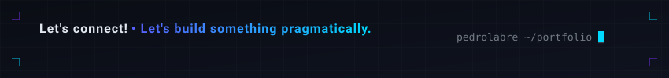

<div align="right">
  <a href="./README.md">🇧🇷 Português</a> &nbsp;•&nbsp; 🇺🇸 <b>English</b>
</div>

<div align="center">

</div>


<div align="center">

+-+IFTO;Software+Developer+%7C+Web%2C+Mobile+%26+Desktop;Focus+on+problem+solving%2C+Software+Engineering+and+QA)

</div>

<div align="center">

[](https://www.linkedin.com/in/pedrolabre/)
[](https://github.com/pedrolabre)
[](https://www.instagram.com/pedrolabre/)


</div>

---

## 👤 About Me

I am 31 years old, have administrative experience, and am fluent in English — a background I gathered before finding my path in software development. I studied advertising in Lisbon, but the pandemic cut that cycle short. Back in Brazil, I found myself without a clear direction until I discovered the Information Systems course at IFTO. I took the selection process, passed in second place, and finally felt I was in the right place.

Over time, I realized that I have a natural ability to identify problems and imagine how to solve them — most of my projects are born from real frustration. Now I am in the 6th period, building projects focused on purpose and practical utility, regardless of the stack, and taking advantage of my undergraduate studies to explore as many areas as possible before deciding where to specialize.

---

## 📋 Technical-Academic Profile

```typescript
const dev = {
  name:           "Pedro Roberto Ribeiro Bandeira Labre",
  role:           "Software Developer (seeking internship)",
  education:      "Information Systems — IFTO (6th semester)",
  location:       "Brazil 🇧🇷",

  background:     "10+ years of professional office experience before transitioning to software",
  languages:      ["Portuguese (native)", "English (fluent)"],

  process:        [
    "Break scope into phases before writing any code",
    "Document implementation plans per feature block",
    "Test and validate each phase independently",
  ],

  currentFocus:   "Web development focused on Single Page Applications (SPA) using Svelte / React",
  building:       "Things that actually solve problems I encounter",
} as const;
```

---

## 🚀 Published Projects

<table>
  <tr>
    <td align="center" valign="middle" width="80">
      
    </td>
    <td>
      <strong>Price Simulator</strong><br/>
      <small>Price simulator with tax, shipping, margin calculation, and report export.</small><br/>
      <a href="https://price-simulator-psi.vercel.app" target="_blank">
        
      </a>
    </td>
  </tr>
  <tr>
    <td align="center" valign="middle" width="80">
      
    </td>
    <td>
      <strong>O que o parlamentar fez</strong><br/>
      <small>Public query tool to explore parliamentarians, bills, and votings with official data from the Brazilian National Congress.</small><br/>
      <a href="https://oqueoparlamentarfez.pages.dev/" target="_blank">
        
      </a>
    </td>
  </tr>
</table>

---

## Technologies Used in Projects


<div align="center">

### ── ⌨️ Programming Languages ──


### ── 💻 Web & Mobile Development ──


### ── 🎨 Frontend & Interface ──


### ── 🌐 Platforms & Ecosystems ──


### ── 🗄️ Data & Persistence ──


### ── 🧪 Code Quality & Testing ──


### ── 🔧 Development Tools ──


### ── 🧭 Design & Prototyping ──


</div>

---

## 📈 GitHub Stats

<div align="center">

<picture>
  <source media="(prefers-color-scheme: dark)" srcset="https://github-readme-stats-pied-mu.vercel.app/api?username=pedrolabre&show_icons=true&theme=tokyonight&hide_border=true&count_private=true&title_color=00D9FF&icon_color=7B2FFF&text_color=c9d1d9&bg_color=0d1117&v=5"/>
  <source media="(prefers-color-scheme: light)" srcset="https://github-readme-stats-pied-mu.vercel.app/api?username=pedrolabre&show_icons=true&theme=default&hide_border=true&count_private=true&title_color=00A3E0&icon_color=6C35DE&text_color=475569&bg_color=ffffff&v=5"/>
  
</picture>
<picture>
  <source media="(prefers-color-scheme: dark)" srcset="https://github-readme-stats-pied-mu.vercel.app/api/top-langs/?username=pedrolabre&layout=compact&theme=tokyonight&hide_border=true&title_color=00D9FF&text_color=c9d1d9&bg_color=0d1117&langs_count=8&count_private=true&v=5"/>
  <source media="(prefers-color-scheme: light)" srcset="https://github-readme-stats-pied-mu.vercel.app/api/top-langs/?username=pedrolabre&layout=compact&theme=default&hide_border=true&title_color=00A3E0&text_color=475569&bg_color=ffffff&langs_count=8&count_private=true&v=5"/>
  
</picture>

</div>

<div align="center">

<picture>
  <source media="(prefers-color-scheme: dark)" srcset="https://github-readme-streak-stats.herokuapp.com/?user=pedrolabre&theme=tokyonight&hide_border=true&ring=7B2FFF&fire=FF6B6B&currStreakLabel=00D9FF&sideLabels=00D9FF&background=0d1117&stroke=00D9FF&dates=8b949e&v=5"/>
  <source media="(prefers-color-scheme: light)" srcset="https://github-readme-streak-stats.herokuapp.com/?user=pedrolabre&theme=default&hide_border=true&ring=6C35DE&fire=FF5F56&currStreakLabel=00A3E0&sideLabels=00A3E0&background=ffffff&stroke=00A3E0&dates=475569&v=5"/>
  
</picture>

</div>

<div align="center">

<picture>
  <source media="(prefers-color-scheme: dark)" srcset="https://github-readme-activity-graph.vercel.app/graph?username=pedrolabre&theme=tokyo-night&hide_border=true&bg_color=0d1117&color=00D9FF&line=7B2FFF&point=ffffff&area=true&v=5"/>
  <source media="(prefers-color-scheme: light)" srcset="https://github-readme-activity-graph.vercel.app/graph?username=pedrolabre&theme=default&hide_border=true&bg_color=ffffff&color=00A3E0&line=6C35DE&point=ffffff&area=true&v=5"/>
  
</picture>

</div>

## 🎓 Academic Projects (Information Systems - IFTO)

These are the structured projects, reports, specifications, and coursework developed during my undergraduate studies. To keep the profile page clean and dynamic, the full catalog has been moved to a dedicated section.

<div align="center">

[](./academic/README_EN.md)

</div>

## 🖥️ Personal Projects & Productivity Automations

Personal utilities, browser extensions, offline dashboards, and micro-scripts developed to automate daily tasks and optimize local workflows.

<div align="center">

[](./projects.md)

</div>

---

## 📜 Certificates & Complementary Education

I collect certifications, free courses, and participation in academic/technological events, totaling **35 records** organized by area of competence.

<div align="center">

| 🤖 1. AI & ML | ⚙️ 2. Automation | 💻 3. Dev & Web | 📊 4. Data & BI | 🛡️ 5. QA & Sec | 🏫 6. Events |
|:---:|:---:|:---:|:---:|:---:|:---:|
| **9 Certificates** | **3 Certificates** | **4 Certificates** | **8 Certificates** | **3 Certificates** | **8 Certificates** |

<br/>

[](./certificates.md)

</div>

---


## 🐍 Contributions

<div align="center">


</div>

---

<div align="center">

> *"The true programmer of the future is not the one who types memorized lines of code, but the one who understands logic and guides the best tools with a critical eye."*

<br/>

[](https://www.linkedin.com/in/pedrolabre/)




</div>
