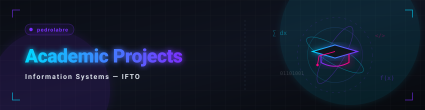

  <a href="./README.md">🇧🇷 Português</a> &nbsp;•&nbsp; 🇺🇸 <b>English</b>

  <a href="../README_EN.md">🏠 Back to Home</a>

---

  

## 📌 Index of Competencies

Use the index below to navigate directly to specific topics and explore the related projects and documents:

* [**💻 1. Programming & Systems Development**](#programacao)
  *Practical software development projects focusing on object-oriented programming, concurrency, and operating systems.*
* [**📄 2. Technical Reports, Specifications & Software Engineering**](#documentacao)
  *Analytical reports, requirements specifications, QA test plans, and governance studies.*
* [**📊 3. Technical Presentations & Project Slides**](#apresentacoes)
  *Slide decks, project proposals, and MVP demonstrations.*
* [**🌐 4. Network Simulations & Practical Labs**](#redes)
  *Network topologies, dynamic routing on Cisco Packet Tracer, and traffic analyses with Wireshark.*
* [**🗄️ 5. Data Modeling, Management & Schemas**](#dados)
  *Relational SQL scripts (DDL/DML) and data modeling in JSON and XML.*
* [**🧠 6. Artificial Intelligence & Theory of Computation**](#ia-teoria)
  *Search algorithms (BFS), state models, and formal Turing Machines.*
* [**🎨 7. Interface Design & Usability (HCI)**](#design)
  *High-fidelity prototyping, HCI, usability guidelines, and user-centric interface design.*

---

<h2 id="programacao">💻 1. Programming & Systems Development</h2>

These are the structured projects I developed for courses in my Information Systems degree at **IFTO**, where I formally applied development paradigms, concurrency concepts, operating systems, and OOP:

| 📁 Project | 📝 Description | 🛠️ Stack | 🔗 |
|:---|:---|:---|:---:|
| **cpu-scheduling-simulator** | Interactive CPU scheduling algorithm simulator (FIFO, SJF, SRTF, Priority, Round Robin) with Gantt charts for Operating Systems | JavaScript • React |  |
| **truth-or-dare-async-network** | Interactive mobile social network app and asynchronous truth-or-dare game, integrated with high-fidelity prototyping and a test plan | TypeScript • React Native • Expo |  |
| **LTP3-CRUD-Laravel** | Web application with full CRUD and relational database persistence, developed in Laravel for the LTP3 course | PHP • Laravel • Blade |  |
| **Sistema-de-Cadastro-IFTO** | Academic registration system applying fundamental object-oriented programming (OOP) concepts and MVC architecture | PHP |  |
| **Caixa-Eletronico** | Logical ATM simulator with business rules for withdrawals and bill counting using OOP PHP | PHP |  |
| **gerenciador-de-livros-php** | Basic personal library control web CRUD for the introduction to web development course | PHP |  |
| **LTP2-site-receitas** | Responsive recipe portal frontend with route simulation, login, and user dashboard in localStorage | HTML • CSS • JS |  |
| **IHC-prototipo-ingles** | Responsive interactive prototype with cartoon eyelids, blinking, cross-eyed look, and form transitions for the Human-Computer Interaction course | HTML5 • CSS3 • JS |  |
| **atividade2-estrutura-dados** | Interactive web application for visual simulation and manipulation of arrays and logical Data Structure operations | JavaScript • HTML5 |  |
| **ltp2-calculadora-aritmetica** | Interactive web calculator for arithmetic operations developed as a practical activity for LTP2 | JavaScript • HTML5 • CSS |  |
| **ltp2-tabuadas-interativas** | Interactive web pages for dynamic arithmetic multiplication tables developed for the LTP2 course | JavaScript • HTML5 • CSS |  |
| **ltp2-tabuadas-todas-operacoes** | Interactive web application of complete multiplication tables for all basic arithmetic operations (addition, subtraction, multiplication, and division) in LTP2 | JavaScript • HTML5 • CSS |  |

 

  <a href="#top">🔺 Back to Top</a>

---

<h2 id="documentacao">📄 2. Technical Reports, Specifications & Software Engineering</h2>

Technical reports, formal requirements specifications, QA test plans, and software engineering case studies developed during my undergraduate studies:

| 📁 Document | 📝 Description | 🛠️ Stack | 🔗 |
|:---|:---|:---|:---:|
| **ltp3-relatorio-gerenciador-livros** | Finalized analytical technical report on the architecture and implementation of the CRUD digital library in PHP | Technical Documentation • PHP |  |
| **ltp2-projeto-site-receitas** | Complete requirements specification and web architecture manual for the responsive recipe portal | Requirements • LTP2 |  |
| **ltp3-consultoria-tecnologias-web** | Technical consulting report and comparative analysis of web development stacks and architectures | Technical Analysis • LTP3 |  |
| **es2-plano-simples-testes** | Structured test plan and QA specification developed in the Software Engineering II course | Test Engineering • QA |  |
| **es2-trabalho-projeto-fenix** | Agile management case study and metrics analysis within the scope of the Phoenix Project | Software Engineering II |  |
| **es2-atividade-metricas-software** | Practical research on evaluating and applying coupling, cohesion, and cyclomatic complexity metrics | Metrics • ESII |  |
| **es2-atividade-metricas-qualidade** | Analytical study and mapping of software quality metrics based on ISO/IEC 25010 standards | Quality • ESII |  |
| **especificacao-todan-1** | Document containing the application theme definition, GitHub repository creation, and initial requirements list (First Delivery) for T.O.D.A.N | Requirements • LTP4 / Mobile |  |
| **especificacao-todan-2** | Document containing the detailed specification and definition of all application requirements (Second Delivery) for T.O.D.A.N | Requirements • LTP4 / Mobile |  |
| **especificacao-todan-3** | Document containing the logical architecture and development state of the MVP during the first presented version (Third Delivery) for T.O.D.A.N | Requirements • LTP4 / Mobile |  |
| **especificacao-todan-4** | Document containing the complete scope review and definition of future requirements planned for the final version (Fourth Delivery) for T.O.D.A.N | Requirements • LTP4 / Mobile |  |
| **especificacao-todan-final** | Definitive project closure document containing the complete and consolidated documentation of the last app version (Final Delivery) for T.O.D.A.N | Requirements • LTP4 / Mobile |  |
| **Consultoria-IFTOverso.pdf** | Case study and strategic infrastructure planning for the IFTOverso academic ecosystem | Software Engineering |  |
| **es1-levantamento-requisitos** | Requirements elicitation, user interviews, persona definition, and market benchmarking for a literary catalog platform | Requirements Engineering • ESI |  |
| **es1-especificacao-requisitos** | Formal specification of functional requirements (FR) and non-functional requirements (NFR - WCAG, performance, and APIs) in Software Engineering I | Requirements Engineering • ESI |  |
| **projeto-gestao-infra-ti-escola** | Strategic plan project for governance, network infrastructure, and IT service management (ITIL/COBIT) for an educational institution | Governance Plan • IT Management |  |
| **lei-de-benford-analise** | Theoretical and historical study on Benford's Law, covering its discovery process, mathematical concepts, and practical applications in auditing | Theoretical Study • IS Foundations |  |
| **Plano-de-Negocio-Figma** | Complete Business Plan (BP) structuring the market viability, technological choices, and digital marketing strategies for an IT e-commerce | Business Plan • E-Commerce |  |

 

  <a href="#top">🔺 Back to Top</a>

---

<h2 id="apresentacoes">📊 3. Technical Presentations & Project Slides</h2>

Slide presentations, technical proposal defenses, and project demonstrations developed during my undergraduate studies:

| 📁 Presentation | 📝 Description | 🛠️ Context | 🔗 |
|:---|:---|:---|:---:|
| **slides-todan-mvp-1** | Slide presentation of the first MVP pitch and conception for the T.O.D.A.N mobile app | Presentation • Mobile / LTP4 |  |
| **slides-todan-mvp-final** | Slide presentation of the final MVP demo and results for the T.O.D.A.N mobile app | Presentation • Mobile / LTP4 |  |
| **Slide-Plano-de-Negocio-Figma** | Slide presentation of the IT e-commerce Business Plan developed for the E-Commerce course | Presentation • E-Commerce |  |
| **Protocolos-Comunicacao-Remota** | Slide presentation on Remote Communication Protocols (Telnet, SSH, SCP) covering theoretical survey and Wireshark test experiments | Presentation • Computer Networks III |  |

 

  <a href="#top">🔺 Back to Top</a>

---

<h2 id="redes">🌐 4. Network Simulations & Practical Labs</h2>

Practical infrastructure, topology, and network traffic analysis labs developed in the **Computer Networks** courses:

| 📁 Lab | 📝 Description | 🛠️ Stack | 🔗 |
|:---|:---|:---|:---:|
| **redes-computadores-2** | Practical network simulation labs and activities (static routing, RIP, OSPF, wireless networks, and multilayer switches) in Cisco Packet Tracer | Simulation • Cisco Packet Tracer |  |
| **redes-computadores-3** | Practical packet capture and inspection labs with Wireshark analyzing real traffic from remote protocols (Telnet, SSH, and SCP) | Traffic Analysis • Wireshark |  |

 

  <a href="#top">🔺 Back to Top</a>

---

<h2 id="dados">🗄️ 5. Data Modeling, Management & Schemas</h2>

Relational and semi-structured data modeling developed in the **Database II** and **Information Management** courses:

| 📁 Project / File | 📝 Description | 🛠️ Stack | 🔗 |
|:---|:---|:---|:---:|
| **cadastro_alunos-sql** | Structured relational database SQL script for academic control in the Database II course | SQL • DDL / DML |  |
| **modelagem-pacientes** | Data modeling for a patient registry system using structured JSON and XML schemas in the Information Management course | JSON • XML • Information Management |   |

 

  <a href="#top">🔺 Back to Top</a>

---

<h2 id="ia-teoria">🧠 6. Artificial Intelligence & Theory of Computation</h2>

Formal algorithms, state machines, and intelligent searches developed in the **Artificial Intelligence** and **Theoretical Aspects of Computation** courses:

| 📁 Project | 📝 Description | 🛠️ Stack | 🔗 |
|:---|:---|:---|:---:|
| **8-puzzle-bfs** | Implementation and resolution of the classic 8-Puzzle problem using the Breadth-First Search (BFS) algorithm in Python | Python • Artificial Intelligence |  |
| **anbn.yaml** | Formal configuration and state transition table for simulating a Turing Machine that validates the context-free language $a^n b^n$ | YAML • Computer Theory |  |

 

  <a href="#top">🔺 Back to Top</a>

---

<h2 id="design">🎨 7. Interface Design & Usability (HCI)</h2>

Layout mockups and visual interface studies developed for the **Human-Computer Interaction** course applying contrast rules, usability guidelines, and visual architecture:

| 📁 Interface | 📝 Description | 🛠️ Stack | 🔗 |
|:---|:---|:---|:---:|
| **IHC-tela-cadastro-ingles.png** | Layout mockup of the registration screen for kids' English, strictly applying the 60-30-10 color contrast rule | HCI • UI/UX Design |  |

 

  <a href="#top">🔺 Back to Top</a>

