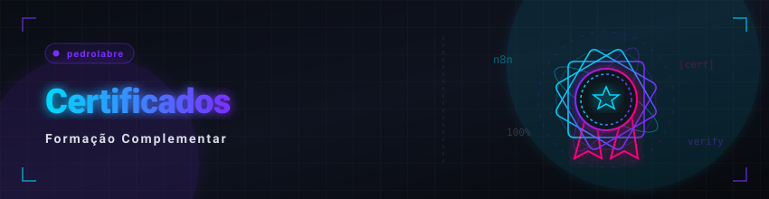

  🇧🇷 <b>Português</b> &nbsp;•&nbsp; <a href="./certificates.md">🇺🇸 English</a>

  <a href="./README.md">🏠 Voltar ao Início</a>

  

## 📌 Índice de Áreas

Use o índice abaixo para navegar diretamente para as seções de certificados organizadas por área de competência:

* [**🤖 1. Inteligência Artificial & Machine Learning**](#ia)
  *Modelos generativos, aprendizado de máquina e gestão de produtos com IA.*
* [**⚙️ 2. Automação & Agentes Inteligentes**](#automacao)
  *Construção de fluxos automatizados e agentes autônomos (n8n, LangChain, etc).*
* [**💻 3. Desenvolvimento de Software & Arquitetura Web**](#dev)
  *Programação estruturada, front-end, back-end e design de sistemas.*
* [**📊 4. Análise de Dados, Python & Business Intelligence**](#dados)
  *Lógica com Python, análise de dados, planilhas e Power BI.*
* [**🛡️ 5. Infraestrutura, Qualidade (QA) & Segurança**](#infra)
  *Testes de software, redes, virtualização e segurança ofensiva.*
* [**🏫 6. Eventos Acadêmicos, Extensão & Habilidades**](#eventos)
  *Eventos regionais de tecnologia da informação, ideathons, e competências multidisciplinares.*

---

<h2 id="ia">🤖 1. Inteligência Artificial & Machine Learning</h2>

Certificações focadas em IA generativa, Machine Learning e Gestão de Produtos com IA.

| 🎓 Curso / Certificação | ⏱️ Carga Horária | 🏫 Instituição / Emissor | 📅 Ano | 🔗 PDF |
|:---|:---:|:---|:---:|:---:|
| **Engenharia de Prompt para Engenheiros de Software** | 8h | Universidade de São Paulo (USP) - Difusão | 2026 | *indisponível* |
| **Introdução ao Machine Learning com Python** | 8h | Universidade de São Paulo (USP) - Difusão | 2026 | *indisponível* |
| **Jornada Inteligência Artificial (Turma 1)** | 8h | Hashtag Treinamentos | 2026 | [visualizar](./academic/certificados/1-inteligencia-artificial/jornada-ia-hashtag-2026-t1.pdf) |
| **Jornada Inteligência Artificial (Turma 2)** | 8h | Hashtag Treinamentos | 2026 | [visualizar](./academic/certificados/1-inteligencia-artificial/jornada-ia-hashtag-2026-t2.pdf) |
| **Missão Programação com IA do Zero** | 8h | Rocketseat | 2026 | [visualizar](./academic/certificados/1-inteligencia-artificial/missao-programacao-ia-do-zero.pdf) |
| **Simplifica Inteligência Artificial Express** | 4h | Simplifica IA | 2026 | [visualizar](./academic/certificados/1-inteligencia-artificial/simplifica-ia-express.pdf) |
| **AI Product Owner 8K+** | 4h | Canal Valor | 2026 | [visualizar](./academic/certificados/1-inteligencia-artificial/ai-product-owner-8k.pdf) |
| **AI Product Week** | 2h | PM3 | 2026 | [visualizar](./academic/certificados/1-inteligencia-artificial/ai-product-week.pdf) |
| **Jornada Inteligência Artificial (Edição 2024)** | 8h | Hashtag Treinamentos | 2024 | [visualizar](./academic/certificados/1-inteligencia-artificial/jornada-ia-hashtag-2024.pdf) |

 

  <a href="#top">🔺 Voltar ao Topo</a>

---

<h2 id="automacao">⚙️ 2. Automação & Agentes Inteligentes</h2>

Certificações focadas na construção de automações e fluxos de agentes inteligentes.

| 🎓 Curso / Certificação | ⏱️ Carga Horária | 🏫 Instituição / Emissor | 📅 Ano | 🔗 PDF |
|:---|:---:|:---|:---:|:---:|
| **Carreira IA: Do Zero ao Primeiro Agente com n8n** | 5h | Rocketseat | 2026 | [visualizar](./academic/certificados/2-automacao-agentes/agentes-ia-n8n-rocketseat.pdf) |
| **Imersão Agentes de IA (Turma 1)** | 8h | Hashtag Treinamentos | 2026 | [visualizar](./academic/certificados/2-automacao-agentes/imersao-agentes-ia-hashtag-t1.pdf) |
| **Imersão Agentes de IA (Turma 2)** | 8h | Hashtag Treinamentos | 2026 | [visualizar](./academic/certificados/2-automacao-agentes/imersao-agentes-ia-hashtag-t2.pdf) |

 

  <a href="#top">🔺 Voltar ao Topo</a>

---

<h2 id="dev">💻 3. Desenvolvimento de Software & Arquitetura Web</h2>

Certificações focadas em programação, front-end, back-end e design de sistemas.

| 🎓 Curso / Certificação | ⏱️ Carga Horária | 🏫 Instituição / Emissor | 📅 Ano | 🔗 PDF |
|:---|:---:|:---|:---:|:---:|
| **Lógica de Programação e Estruturas de Dados em C (Letramento Digital)** | 40h | SENAI TO | 2026 | *indisponível* |
| **Fundamentos em Python** | 8h | PNAAT / MCTI | 2026 | [visualizar](./academic/certificados/3-desenvolvimento-arquitetura/fundamentos-python-pnaat.pdf) |
| **Imersão Front-End com IA** | 2h | Alura | 2026 | [visualizar](./academic/certificados/3-desenvolvimento-arquitetura/imersao-front-end-ia-alura.pdf) |
| **Imersão Arquitetura Web com IA** | 4h | Alura | 2026 | [visualizar](./academic/certificados/3-desenvolvimento-arquitetura/imersao-arquitetura-web-ia-alura.pdf) |
| **System Design com IA Aplicada na Prática** | 2h | Dev+Eficiente (Workshop) | 2026 | [visualizar](./academic/certificados/3-desenvolvimento-arquitetura/system-design-ia-dev-eficiente.pdf) |

 

  <a href="#top">🔺 Voltar ao Topo</a>

---

<h2 id="dados">📊 4. Análise de Dados, Python & Business Intelligence</h2>

Certificações e imersões focadas em dados, programação com Python e inteligência de negócios.

| 🎓 Curso / Certificação | ⏱️ Carga Horária | 🏫 Instituição / Emissor | 📅 Ano | 🔗 PDF |
|:---|:---:|:---|:---:|:---:|
| **Imersão Profissional Jornada de Dados** | 10h | Luciano Vasconcelos | 2026 | [visualizar](./academic/certificados/4-dados-python-bi/imersao-profissional-jornada-dados.pdf) |
| **Imersão Dados com Python II** | 4h | Alura | 2026 | [visualizar](./academic/certificados/4-dados-python-bi/imersao-dados-python-ii-alura.pdf) |
| **Jornada Python (Turma 1)** | 8h | Hashtag Treinamentos | 2026 | [visualizar](./academic/certificados/4-dados-python-bi/jornada-python-hashtag-2026-t1.pdf) |
| **Jornada Python (Turma 2)** | 8h | Hashtag Treinamentos | 2026 | [visualizar](./academic/certificados/4-dados-python-bi/jornada-python-hashtag-2026-t2.pdf) |
| **Semana do Excel** | 8h | Hashtag Treinamentos | 2026 | [visualizar](./academic/certificados/4-dados-python-bi/semana-excel-hashtag-2026.pdf) |
| **Intensivo de Power BI e Inteligência Artificial** | 8h | Letícia Smirelli | 2026 | [visualizar](./academic/certificados/4-dados-python-bi/intensivo-powerbi-inteligencia-artificial.pdf) |
| **Jornada Python (Edição 2024)** | 8h | Hashtag Treinamentos | 2024 | [visualizar](./academic/certificados/4-dados-python-bi/jornada-python-hashtag-2024.pdf) |
| **Treinamento Maratona Excel** | 8h | Tetra Educação | 2024 | [visualizar](./academic/certificados/4-dados-python-bi/treinamento-maratona-excel.pdf) |

 

  <a href="#top">🔺 Voltar ao Topo</a>

---

<h2 id="infra">🛡️ 5. Infraestrutura, Qualidade (QA) & Segurança</h2>

Certificações focadas na qualidade de código, infraestrutura, virtualização de servidores e segurança da informação.

| 🎓 Curso / Certificação | ⏱️ Carga Horária | 🏫 Instituição / Emissor | 📅 Ano | 🔗 PDF |
|:---|:---:|:---|:---:|:---:|
| **Curso Gratuito de Testes de Software** | 6h | Julio de Lima Consultoria | 2026 | [visualizar](./academic/certificados/5-infraestrutura-qa-seguranca/curso-testes-de-software.pdf) |
| **Imersão de Virtualização de Servidores Multi-Plataforma** | 6h | Virtualização na Prática | 2026 | [visualizar](./academic/certificados/5-infraestrutura-qa-seguranca/imersao-virtualizacao-servidores.pdf) |
| **Guia Fundamental de Offsec (Segurança Ofensiva)** | 4h | WB Educação / OffSec | 2026 | [visualizar](./academic/certificados/5-infraestrutura-qa-seguranca/guia-fundamental-offsec.pdf) |

 

  <a href="#top">🔺 Voltar ao Topo</a>

---

<h2 id="eventos">🏫 6. Eventos Acadêmicos, Extensão & Habilidades Complementares</h2>

Participações em encontros científicos regionais, maratonas de inovação (Ideathons) e cursos complementares em outras áreas (tradução, saúde digital, intercâmbios e desenvolvimento regional).

| 🎓 Curso / Certificação / Evento | ⏱️ Carga Horária | 🏫 Instituição / Emissor | 📅 Ano | 🔗 PDF |
|:---|:---|:---|:---:|:---:|
| **8º ETIVA - Encontro de Tecnologia da Informação do Vale do Araguaia** | 20h | Instituto Federal do Tocantins (IFTO) | 2025 | *indisponível* |
| **Seminário de Inovação Fapto/Ideathon - Pitch** | 3h | SEBRAE | 2025 | *indisponível* |
| **Semana Integrada IFTO Campus Paraíso** | 20h | Instituto Federal do Tocantins (IFTO) | 2025 | *indisponível* |
| **Introdução à Saúde Digital** | 45h | FIOCRUZ | 2025 | *indisponível* |
| **7º ETIVA - Encontro de Tecnologia da Informação do Vale do Araguaia** | 26h | Instituto Federal do Tocantins (IFTO) | 2024 | *indisponível* |
| **Jornada Canadense: Relato de Intercâmbio Transcultural (Edital Interno)** | 4h | Instituto Federal do Tocantins (IFTO) | 2024 | *indisponível* |
| **Revolucionando a Inteligência Financeira e o Cooperativismo** | 4h | Instituto Federal do Tocantins (IFTO) | 2024 | *indisponível* |
| **De Bilíngue a Tradutor: Como Começar na Tradução** | 6h | Vida de Tradutor | 2026 | *indisponível* |

 

  <a href="#top">🔺 Voltar ao Topo</a>

