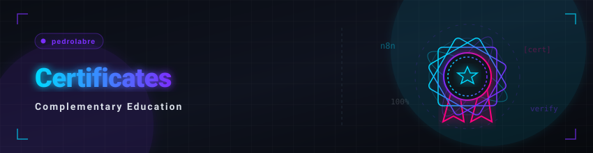

  <a href="./certificados.md">🇧🇷 Português</a> &nbsp;•&nbsp; 🇺🇸 <b>English</b>

  <a href="./README_EN.md">🏠 Back to Home</a>

  

## 📌 Areas Index

Use the index below to navigate directly to the certificates sections organized by area of competence:

* [**🤖 1. Artificial Intelligence & Machine Learning**](#ia)
  *Generative models, machine learning, and AI product management.*
* [**⚙️ 2. Automation & Intelligent Agents**](#automacao)
  *Building automated workflows and autonomous agents (n8n, LangChain, etc).*
* [**💻 3. Software Development & Web Architecture**](#dev)
  *Structured programming, front-end, back-end, and system design.*
* [**📊 4. Data Analysis, Python & Business Intelligence**](#dados)
  *Python logic, data analysis, spreadsheets, and Power BI.*
* [**🛡️ 5. Infrastructure, Quality (QA) & Security**](#infra)
  *Software testing, networks, virtualization, and offensive security.*
* [**🎨 6. Design, UI/UX & Prototyping**](#design)
  *Interface design, user experience, and visual prototyping tools.*
* [**🏫 7. Academic Events, Extension & Complementary Skills**](#eventos)
  *Regional IT events, ideathons, and multidisciplinary skills.*

---

<h2 id="ia">🤖 1. Artificial Intelligence & Machine Learning</h2>

Certifications focused on generative AI, Machine Learning, and AI Product Management.

| 🎓 Course / Certification | ⏱️ Hours | 🏫 Institution / Issuer | 📅 Year | 🔗 PDF |
|:---|:---:|:---|:---:|:---:|
| **Google AI Professional Certificate** | 13h | Google / Coursera | 2026 | [view](./academic/certificados/1-inteligencia-artificial/google-ai-essentials/google-ai-essentials.pdf) |
| **Prompt Engineering for Software Engineers** | 8h | Universidade de São Paulo (USP) - Difusão | 2026 | *unavailable* |
| **AI for Devs Bootcamp** | 8h | Full Cycle | 2026 | [view](./academic/certificados/1-inteligencia-artificial/imersao-ia-for-devs-fullcycle.pdf) |
| **Introduction to Machine Learning with Python** | 8h | Universidade de São Paulo (USP) - Difusão | 2026 | *unavailable* |
| **Artificial Intelligence Journey (2024 Edition)** | 8h | Hashtag Treinamentos | 2024 | [view](./academic/certificados/1-inteligencia-artificial/jornada-ia-hashtag-2024.pdf) |
| **Artificial Intelligence Journey (Batch 1)** | 8h | Hashtag Treinamentos | 2026 | [view](./academic/certificados/1-inteligencia-artificial/jornada-ia-hashtag-2026-t1.pdf) |
| **Artificial Intelligence Journey (Batch 2)** | 8h | Hashtag Treinamentos | 2026 | [view](./academic/certificados/1-inteligencia-artificial/jornada-ia-hashtag-2026-t2.pdf) |
| **AI Programming Mission from Zero** | 8h | Rocketseat | 2026 | [view](./academic/certificados/1-inteligencia-artificial/missao-programacao-ia-do-zero.pdf) |
| **AI Product Owner 8K+** | 4h | Canal Valor | 2026 | [view](./academic/certificados/1-inteligencia-artificial/ai-product-owner-8k.pdf) |
| **Simplify AI Express** | 4h | Simplifica IA | 2026 | [view](./academic/certificados/1-inteligencia-artificial/simplifica-ia-express.pdf) |
| **AI Product Week** | 2h | PM3 | 2026 | [view](./academic/certificados/1-inteligencia-artificial/ai-product-week.pdf) |

 

  <a href="#top">🔺 Back to Top</a>

---

<h2 id="automacao">⚙️ 2. Automation & Intelligent Agents</h2>

Certifications focused on building automations and intelligent agent workflows.

| 🎓 Course / Certification | ⏱️ Hours | 🏫 Institution / Issuer | 📅 Year | 🔗 PDF |
|:---|:---:|:---|:---:|:---:|
| **AI Agents Bootcamp (Batch 1)** | 8h | Hashtag Treinamentos | 2026 | [view](./academic/certificados/2-automacao-agentes/imersao-agentes-ia-hashtag-t1.pdf) |
| **AI Agents Bootcamp (Batch 2)** | 8h | Hashtag Treinamentos | 2026 | [view](./academic/certificados/2-automacao-agentes/imersao-agentes-ia-hashtag-t2.pdf) |
| **AI Career: From Zero to the First Agent with n8n** | 5h | Rocketseat | 2026 | [view](./academic/certificados/2-automacao-agentes/agentes-ia-n8n-rocketseat.pdf) |

 

  <a href="#top">🔺 Back to Top</a>

---

<h2 id="dev">💻 3. Software Development & Web Architecture</h2>

Certifications focused on programming, front-end, back-end, and system design.

| 🎓 Course / Certification | ⏱️ Hours | 🏫 Institution / Issuer | 📅 Year | 🔗 PDF |
|:---|:---:|:---|:---:|:---:|
| **Programming Logic and Data Structures in C (Digital Literacy)** | 40h | SENAI TO | 2026 | *unavailable* |
| **Python Foundations** | 8h | PNAAT / MCTI | 2026 | [view](./academic/certificados/3-desenvolvimento-arquitetura/fundamentos-python-pnaat.pdf) |
| **Python** | 8h | Santander Open Academy | 2026 | [view](./academic/certificados/3-desenvolvimento-arquitetura/python-santander.pdf) |
| **Web Architecture with AI Bootcamp** | 4h | Alura | 2026 | [view](./academic/certificados/3-desenvolvimento-arquitetura/imersao-arquitetura-web-ia-alura.pdf) |
| **Front-End with AI Bootcamp** | 2h | Alura | 2026 | [view](./academic/certificados/3-desenvolvimento-arquitetura/imersao-front-end-ia-alura.pdf) |
| **System Design with Practical Applied AI** | 2h | Dev+Eficiente (Workshop) | 2026 | [view](./academic/certificados/3-desenvolvimento-arquitetura/system-design-ia-dev-eficiente.pdf) |

 

  <a href="#top">🔺 Back to Top</a>

---

<h2 id="dados">📊 4. Data Analysis, Python & Business Intelligence</h2>

Certifications and bootcamps focused on data, programming with Python, and business intelligence.

| 🎓 Course / Certification | ⏱️ Hours | 🏫 Institution / Issuer | 📅 Year | 🔗 PDF |
|:---|:---:|:---|:---:|:---:|
| **Google Data Analytics - Foundations: Data, Data, Everywhere (1/9)** | 12h | Google / Coursera | 2026 | [view](./academic/certificados/4-dados-python-bi/google-data-analytics/foundations-data-everywhere.pdf) |
| **Professional Data Journey Bootcamp** | 10h | Luciano Vasconcelos | 2026 | [view](./academic/certificados/4-dados-python-bi/imersao-profissional-jornada-dados.pdf) |
| **Excel Automate Bootcamp** | 8h | Tetra Educação | 2026 | [view](./academic/certificados/4-dados-python-bi/imersao-excel-automate.pdf) |
| **Power BI and Artificial Intelligence Intensive** | 8h | Letícia Smirelli | 2026 | [view](./academic/certificados/4-dados-python-bi/intensivo-powerbi-inteligencia-artificial.pdf) |
| **Python Journey (2024 Edition)** | 8h | Hashtag Treinamentos | 2024 | [view](./academic/certificados/4-dados-python-bi/jornada-python-hashtag-2024.pdf) |
| **Python Journey (Batch 1)** | 8h | Hashtag Treinamentos | 2026 | [view](./academic/certificados/4-dados-python-bi/jornada-python-hashtag-2026-t1.pdf) |
| **Python Journey (Batch 2)** | 8h | Hashtag Treinamentos | 2026 | [view](./academic/certificados/4-dados-python-bi/jornada-python-hashtag-2026-t2.pdf) |
| **Excel Week** | 8h | Hashtag Treinamentos | 2026 | [view](./academic/certificados/4-dados-python-bi/semana-excel-hashtag-2026.pdf) |
| **Make Better Data-Driven Decisions: Power BI** | 8h | Santander X | 2026 | [view](./academic/certificados/4-dados-python-bi/powerbi-santanderx.pdf) |
| **Excel Marathon Training** | 8h | Tetra Educação | 2024 | [view](./academic/certificados/4-dados-python-bi/treinamento-maratona-excel.pdf) |
| **Data Bootcamp with Python II** | 4h | Alura | 2026 | [view](./academic/certificados/4-dados-python-bi/imersao-dados-python-ii-alura.pdf) |
| **Power BI Mini Course** | 3h | Xperiun | 2026 | [view](./academic/certificados/4-dados-python-bi/minicurso-powerbi-xperium.pdf) |
| **Databricks + AI Workshop** | 2h | Luciano Vasconcelos | 2026 | [view](./academic/certificados/4-dados-python-bi/workshop-databricks-ia.pdf) |

 

  <a href="#top">🔺 Back to Top</a>

---

<h2 id="infra">🛡️ 5. Infrastructure, Quality (QA) & Security</h2>

Certifications focused on code quality, infrastructure, server virtualization, and information security.

| 🎓 Course / Certification | ⏱️ Hours | 🏫 Institution / Issuer | 📅 Year | 🔗 PDF |
|:---|:---:|:---|:---:|:---:|
| **Security in Cloud-computing** | 10h | FIA Online | 2026 | [view](./academic/certificados/5-infraestrutura-qa-seguranca/seguranca-cloud-fia.pdf) |
| **Free Software Testing Course** | 6h | Julio de Lima Consultoria | 2026 | [view](./academic/certificados/5-infraestrutura-qa-seguranca/curso-testes-de-software.pdf) |
| **Multi-Platform Server Virtualization Bootcamp** | 6h | Virtualização na Prática | 2026 | [view](./academic/certificados/5-infraestrutura-qa-seguranca/imersao-virtualizacao-servidores.pdf) |
| **Offsec Fundamental Guide (Offensive Security)** | 4h | WB Educação / OffSec | 2026 | [view](./academic/certificados/5-infraestrutura-qa-seguranca/guia-fundamental-offsec.pdf) |
| **QA: The most accessible entry door** | 4h | EBAC | 2026 | [view](./academic/certificados/5-infraestrutura-qa-seguranca/qa-porta-entrada.pdf) |

 

  <a href="#top">🔺 Back to Top</a>

---

<h2 id="design">🎨 6. Design, UI/UX & Prototyping</h2>

Certifications focused on interface design, user experience, and visual prototyping tools.

| 🎓 Course / Certification | ⏱️ Hours | 🏫 Institution / Issuer | 📅 Year | 🔗 PDF |
|:---|:---:|:---|:---:|:---:|
| **Figma + AI Workshop** | 4h | EBAC | 2026 | [view](./academic/certificados/6-design-ui-ux/figma-ia-workshop-ebac.pdf) |

 

  <a href="#top">🔺 Back to Top</a>

---

<h2 id="eventos">🏫 7. Academic Events, Extension & Complementary Skills</h2>

Participation in regional scientific meetings, innovation marathons (Ideathons), and complementary courses in other areas (translation, digital health, exchange programs, and regional development).

| 🎓 Course / Certification / Event | ⏱️ Hours | 🏫 Institution / Issuer | 📅 Year | 🔗 PDF |
|:---|:---|:---|:---:|:---:|
| **Introduction to Digital Health** | 45h | FIOCRUZ | 2025 | *unavailable* |
| **Campus Party Goiás 5 (CPGoiás5)** | 33h | Instituto Campus Party | 2025 | [view](./academic/certificados/7-eventos-academicos/cpgoias5.pdf) |
| **7th ETIVA - Vale do Araguaia Information Technology Meeting** | 26h | Instituto Federal do Tocantins (IFTO) | 2024 | *unavailable* |
| **8th ETIVA - Vale do Araguaia Information Technology Meeting** | 20h | Instituto Federal do Tocantins (IFTO) | 2025 | *unavailable* |
| **IFTO Campus Paraíso Integrated Week** | 20h | Instituto Federal do Tocantins (IFTO) | 2025 | *unavailable* |
| **From Bilingual to Translator: How to Start in Translation** | 6h | Vida de Tradutor | 2026 | *unavailable* |
| **Canadian Journey: Transcultural Exchange Report (Internal Call)** | 4h | Instituto Federal do Tocantins (IFTO) | 2024 | *unavailable* |
| **Revolutionizing Financial Intelligence and Cooperativism** | 4h | Instituto Federal do Tocantins (IFTO) | 2024 | *unavailable* |
| **Fapto Innovation Seminar/Ideathon - Pitch** | 3h | SEBRAE | 2025 | *unavailable* |

 

  <a href="#top">🔺 Back to Top</a>

