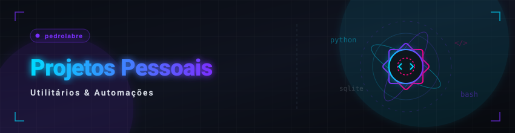

  🇧🇷 <b>Português</b> &nbsp;•&nbsp; <a href="./projects.md">🇺🇸 English</a>

  <a href="./README.md">🏠 Voltar ao Início</a>

  

## 📌 Índice de Projetos

Use o índice abaixo para navegar diretamente para as seções de projetos e scripts:

* [**🖥️ Laboratório de Utilitários Práticos**](#utilitarios)
  *Aplicações Web (SPAs), softwares desktop e extensões de navegador focados em gestão de informações e utilidades cotidianas.*
* [**⚡ Scripts &amp; Micro-Automações de Produtividade**](#scripts)
  *Micro-scripts locais para otimização de rotinas de desenvolvimento e arquivos.*

---

<h2 id="utilitarios">🖥️ Laboratório de Utilitários Práticos (Projetos Pessoais)</h2>

Coleção de Aplicações Web (SPAs), softwares desktop e extensões de navegador desenvolvidos para resolver problemas específicos, gerenciar dados pessoais e otimizar a produtividade diária. Projetos privados possuem indicador visual e acesso restrito de código:

| 📁 Projeto | 📝 Descrição | 🛠️ Stack | 🔗 |
|:---|:---|:---|:---:|
| **legislative-activity-explorer** | SPA conversacional para consulta pública e análise simplificada de proposições e votações do Congresso Nacional | TypeScript • SvelteKit |  |
| **media-history-registry** | SPA para registro histórico de mídias e conteúdos consumidos em JSON | JavaScript • React • Vite |  &nbsp;  |
| **reading-progress-engine** | SPA para gestão de progresso e histórico de leitura com persistência estruturada em JSON | JavaScript • React • Vite |  &nbsp;  |
| **price-simulator** | SPA para simulação de preços comerciais com cálculo de IPI, frete e margem, suporte multi-idioma e exportação | JavaScript • React |  &nbsp;  |
| **photo_organizer** | Solução automatizada para organização cronológica de grandes acervos de fotos via metadados (EXIF) e detecção de duplicatas | Python • EXIF |  |
| **personal-finance-manager** | Dashboard desktop local para controle de finanças pessoais utilizando padrão arquitetural MVVM | C# • WPF • SQLite |  |
| **personal-consumption-tracker** | Aplicação desktop local para monitoramento, análise gráfica e rastreamento de consumo pessoal | C# • WPF • SQLite |  |
| **virtual-closet** 🔒 | Organizador pessoal offline de roupas com integração de widget meteorológico e métricas de Cost-per-Wear | Node.js • SQLite | <picture></picture> &nbsp;  |
| **youtube-organizer** 🔒 | Single Page Application (SPA) para curadoria, categorização e gerenciamento personalizado de vídeos do YouTube | JavaScript • React • Vite | <picture></picture> &nbsp;  |
| **tab-duplicate-detector** 🔒 | Extensão Chrome MV3 para detecção e limpeza inteligente de abas duplicadas via normalização regex | JavaScript • Chrome API | <picture></picture> &nbsp;  |
| **tab-url-extractor** 🔒 | Extensão Chrome MV3 para extração, filtragem e exportação em lote de URLs de abas abertas em um clique | JavaScript • Chrome API | <picture></picture> &nbsp;  |
| **tab-domain-executor** 🔒 | Extensão Chrome MV3 para gerenciamento, agrupamento e fechamento em lote de abas por domínios | TypeScript • Webpack • Chrome API | <picture></picture> &nbsp;  |

 

  <a href="#top">🔺 Voltar ao Topo</a>

---

<h2 id="scripts">⚡ Scripts &amp; Micro-Automações de Produtividade</h2>

Utilitários ágeis que desenvolvi para automatizar rotinas locais de infraestrutura, sincronização de projetos e tratamentos locais de arquivos em lote:

| 📁 Script | 📝 Descrição | 🛠️ Stack | 🔗 |
|:---|:---|:---|:---:|
| **update_mobile_env_ip.py** | Sincroniza automaticamente a configuração de rede do app mobile com o IP local da máquina de desenvolvimento | Python |  |
| **run-local.example.ps1** | Script modelo para configurar variáveis de ambiente e inicializar o servidor de banco de dados e backend localmente | PowerShell |  |
| **generate_reports.py** | Processa em lote imagens duplicadas locais, compilando estatísticas analíticas de economia de espaço | Python |  |
| **export_hashes.py** | Calcula e exporta os hashes criptográficos de grandes bibliotecas de imagens para indexação ultra-veloz | Python |  |
| **organizador_arquivos.py** | Organizador inteligente de arquivos locais que faz varredura e triagem para diretórios por extensão | Python |  |

 

  <a href="#top">🔺 Voltar ao Topo</a>

